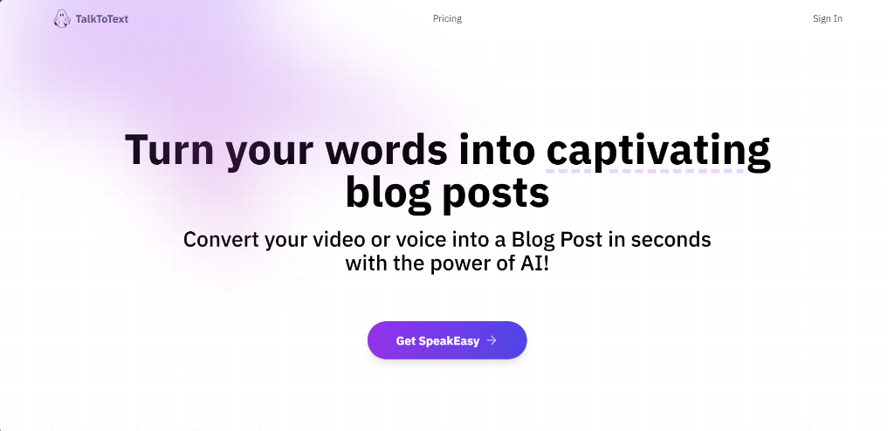

<div align="center">
  <br />
    <a href="https://talktotextai-liart.vercel.app/" target="_blank">
      
    </a>
  <br />

  <h1 align="center">TalkToText</h1>

  <p align="center">
    <strong>Turn your words into captivating blog posts using the power of AI!</strong>
  </p>
  
  <p align="center">
    <a href="https://talktotextai-liart.vercel.app/"><strong>View Live Demo</strong></a>
  </p>

  <p align="center">
    
    
    
    
    
    
    
  </p>
</div>

<br />

## 🚀 Introduction

**TalkToText** is a cutting-edge SaaS platform designed to streamline the content creation process. By leveraging `OpenAI's Whisper model` for audio transcription and `GPT-4` for content generation, it converts video and audio files into SEO-friendly, well-structured blog posts in seconds.

Whether you're a podcaster, YouTuber, or content creator, TalkToText helps you repurpose your content and reach a wider audience with minimal effort.

## ✨ Features

- **🎙️ AI-Powered Transcription**: Accurate audio/video transcription using OpenAI Whisper.
- **📝 Automatic Blog Generation**: Instantly creating engaging blog posts from transcriptions.
- **🔐 Secure Authentication**: Integrated with Clerk for seamless passkey, social, and email logins.
- **💳 Subscription System**: Full Stripe integration with monthly subscriptions (Basic & Pro tiers).
- **💾 Cloud Storage**: Handling file uploads securely with UploadThing (up to 32MB).
- **🖊️ Rich Text Editor**: Markdown-based editor to refine and export your generated posts.
- **📱 Responsive Design**: Beautiful, responsive UI built with TailwindCSS and ShadCN.
- **⚡ Server Actions**: Optimistic updates and efficient server-side logic with Next.js 14.

## 🛠️ Tech Stack

- **Framework**: [Next.js 14](https://nextjs.org/) (App Router)
- **Language**: [TypeScript](https://www.typescriptlang.org/)
- **Styling**: [Tailwind CSS](https://tailwindcss.com/) & [ShadCN UI](https://ui.shadcn.com/)
- **Auth**: [Clerk](https://clerk.com/)
- **Database**: [Neon (PostgreSQL)](https://neon.tech/)
- **Payments**: [Stripe](https://stripe.com/)
- **AI Models**: [OpenAI](https://openai.com/) (Whisper & GPT-4)
- **File Uploads**: [UploadThing](https://uploadthing.com/)

## ⚡ Getting Started

To run this project locally, follow these steps:

### 1. Clone the repository

```bash
git clone https://github.com/saiffshaikkh/AI-Vide-To-Blog-SaaS.git
cd talktotext
```

### 2. Set up Environment Variables

Create a `.env.local` file in the root directory and add the following keys:

```env
NEXT_PUBLIC_CLERK_PUBLISHABLE_KEY=pk_test_...
CLERK_SECRET_KEY=sk_test_...

DATABASE_URL=postgres://...

STRIPE_SECRET_KEY=sk_test_...
STRIPE_WEBHOOK_SECRET=whsec_...

OPENAI_API_KEY=sk-...
UPLOADTHING_TOKEN=...
```

### 3. Install Dependencies

```bash
npm install
```

### 4. Run Development Server

```bash
npm run dev
```

Open [http://localhost:3000](http://localhost:3000) with your browser to see the result.

<p align="center">
  Built with ❤️ by Saif Shaikh
</p>
